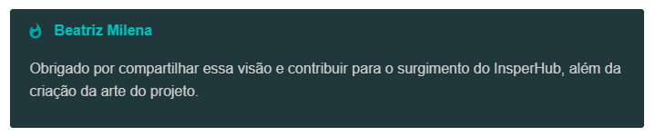

# ✨ InsperHub

### **Descubra. Desenvolva. Expresse.**

A plataforma que acompanha artistas durante todo o processo de criação de personagens.

Pesquise referências, organize ideias, monte moodboards e utilize IA para transformar conceitos em personagens memoráveis.

---

# 📖 Sobre

O **InsperHub** é uma plataforma desenvolvida para artistas digitais, ilustradores, concept artists e criadores de Original Characters (OCs).

Seu objetivo é centralizar tudo o que faz parte da etapa de concepção de um personagem. Em vez de abrir dezenas de abas procurando referências, o artista encontra em um único lugar ferramentas para pesquisar inspirações, organizar ideias e receber sugestões inteligentes durante o processo criativo.

O InsperHub **não gera a arte final**. Seu propósito é potencializar a criatividade do artista, tornando a criação de personagens mais rápida, organizada e inspiradora.

---

# ✨ Funcionalidades

- 🔎 Pesquisa de referências visuais
- 🖼️ Criação de moodboards
- 📋 Checklists para desenvolvimento de personagens
- 🎨 Sugestões de paletas de cores utilizando IA
- 👕 Inspiração para roupas e estilos
- 💍 Sugestões de acessórios
- 💇 Ideias de penteados
- 🤖 Chat com IA capaz de compreender imagens para auxiliar durante a criação
- ❤️ Favoritar referências
- 📁 Organização de projetos

---

# 🤖 Inteligência Artificial

O InsperHub conta com um assistente de IA desenvolvido para atuar como um **copiloto criativo** durante todo o processo de criação.

Além de conversar naturalmente com o artista, a IA é capaz de **compreender imagens**. Basta enviar um print, sketch ou uma captura da sua arte em andamento para receber sugestões contextualizadas.

A IA pode ajudar com:

- 🎨 Sugestões de paletas de cores que combinem com o conceito do personagem.
- 👕 Recomendações de roupas, acessórios e penteados.
- 📋 Análise dos checklists para identificar elementos que podem complementar o design.
- 💡 Ideias para tornar o personagem mais consistente visualmente.
- 🖼️ Sugestões de novas referências de acordo com o estilo da arte.
- ✏️ Feedback sobre a composição, silhueta, legibilidade e identidade visual do personagem.

Ao entender tanto o contexto da conversa quanto as imagens enviadas pelo artista, a IA oferece sugestões muito mais precisas e alinhadas ao projeto.

---

# 📱 Experiência em qualquer dispositivo

O InsperHub foi desenvolvido para oferecer uma excelente experiência em **computadores, tablets e smartphones**.

Seu principal diferencial está na experiência em **tablets**, onde sua interface foi cuidadosamente projetada para ocupar apenas uma pequena área da tela — aproximadamente **1/3 do espaço**. Isso permite que o artista mantenha seu software de desenho aberto na maior parte da tela enquanto consulta referências, moodboards, checklists e sugestões da IA sem interromper seu fluxo de trabalho.

Em vez de competir pelo espaço, o InsperHub funciona como um **painel lateral de apoio**, sempre acessível durante a criação do personagem.

Além disso, a interface foi cuidadosamente adaptada para cada plataforma:

- 💻 **Computadores:** maior produtividade aproveitando todo o espaço da tela.
- 📲 **Tablets:** interface otimizada para multitarefa, ocupando cerca de um terço da tela e permitindo desenhar simultaneamente.
- 📱 **Smartphones:** interface intuitiva para consultar projetos e referências em qualquer lugar.

---

# 🎯 Objetivo

Facilitar a criação de personagens reunindo, em um único ambiente, todas as ferramentas que normalmente ficam espalhadas entre diversos sites e aplicativos.

O InsperHub busca reduzir o tempo gasto procurando referências e aumentar o tempo dedicado ao que realmente importa: **criar**.

---

# 🚫 O que o InsperHub não é

O InsperHub **não é um gerador de imagens**.

A plataforma foi criada para atuar como um copiloto criativo, auxiliando artistas durante a fase de planejamento e desenvolvimento de personagens, sem substituir sua criatividade ou seu estilo artístico.

---

# 👥 Público-alvo

- 🎨 Artistas Digitais
- ✏️ Ilustradores
- 🧙 Character Designers
- 🏰 Concept Artists
- 📚 Escritores
- 🎲 Mestres de RPG
- 🌎 Criadores de Original Characters (OCs)

---

# 🌟 Visão

Ser a principal plataforma de apoio à criação de personagens, oferecendo ferramentas inteligentes que tornem o processo criativo mais organizado, produtivo e inspirador.

---

# ❤️ Agradecimentos

Este projeto foi inspirado por uma ideia apresentada por:

 

 

 

#### **Descubra. Desenvolva. Expresse.**

